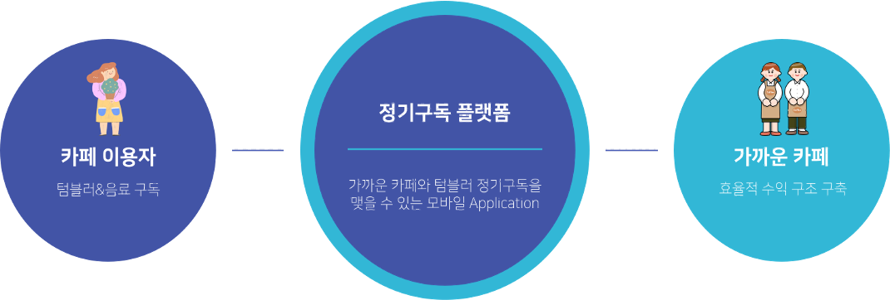
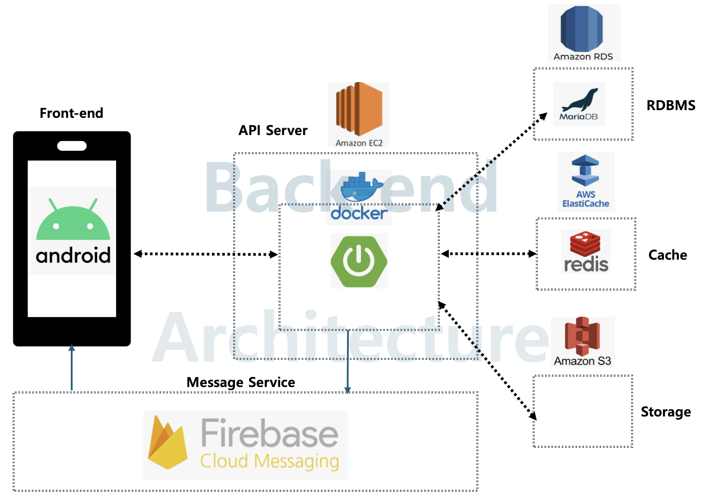
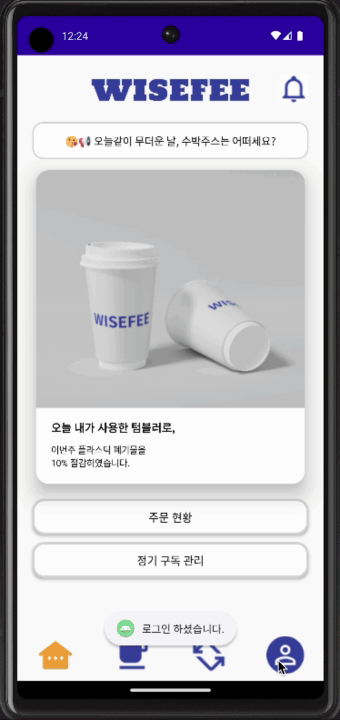
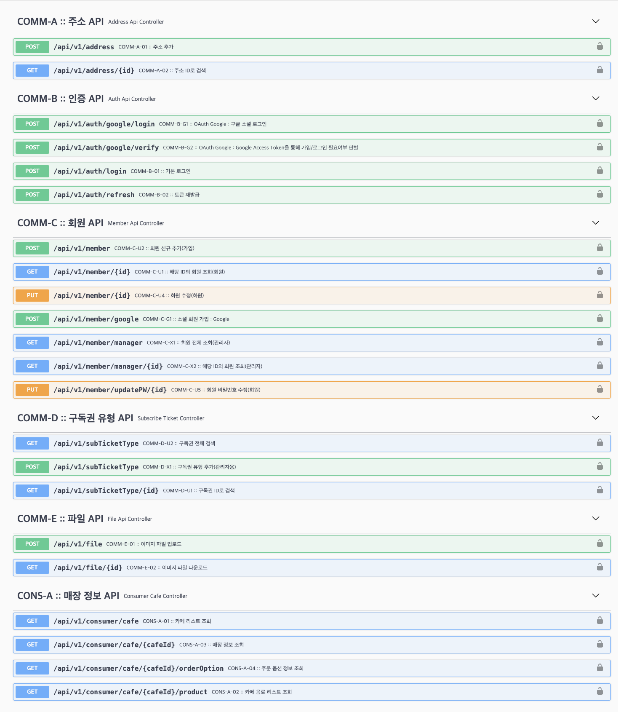
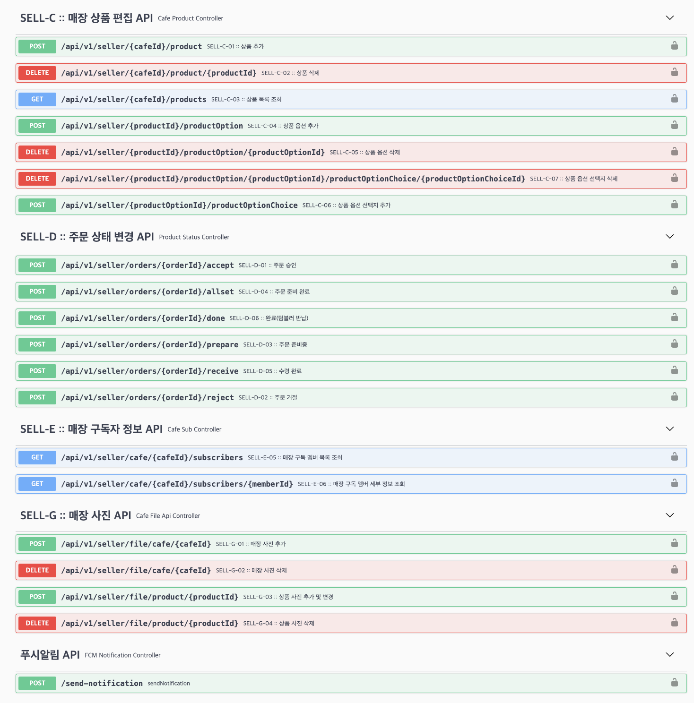
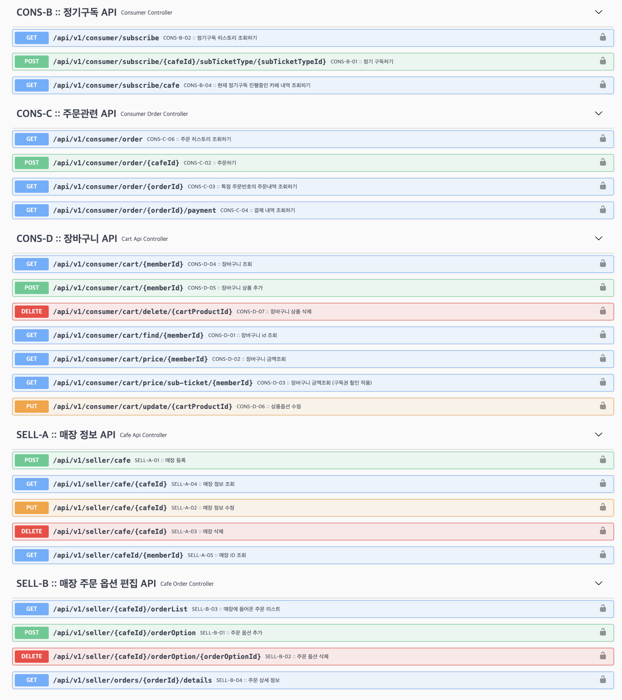

# SKLookie SMU_Wisefee API Server

## 카페 정기구독 플랫폼 : 텀블러 사용을 촉진하기 위한 비즈니스 모델

 

## Stack
<b>Backend : </b>
  
 
  
  

<b>DevOps & Deploy : </b>
   
  
   
           

  

## 시스템 아키텍쳐

    

## 결과물

    

## API 스펙 상세

